# Lista de Exercícios - Respostas
## Geometria Afim e Euclidiana

### **Questão 1** - 1 ponto:

Considerando as matrizes de transformação que vimos em aula (translação,
rotação, escala), escreva a matriz de transformação
**composta** (quando aplicável) para as operações seguintes. Você deve
escrever as matrizes com as coordenadas homogêneas.

1. Translação em 2D com um deslocamento t = (4, 9)

    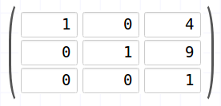
1. Rotação 2D no eixo Z por um ângulo &theta; = π/4
   - Considere `sin(π/4) = cos(π/4) = 0,71`

    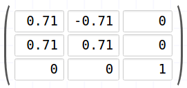
1. Escala não uniforme de 200% no eixo x, 75% no eixo y em 2D

    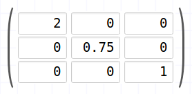
1. Reflexão pelos eixos X e Y em 2D
    - Considerando rotação sobre o eixo y:

    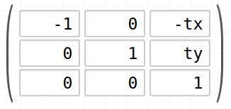
    - Considerando rotação sobre o eixo x:

    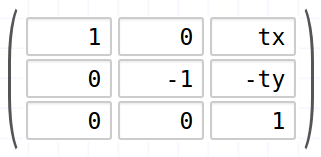
    - Considerando rotação sobre os dois eixos:

    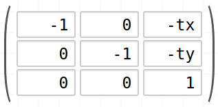
1. Rotação em 2D em relação ao ponto P(5,2)
    
    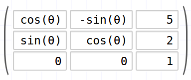

    

---
### **Questão 2** - 1 ponto:

Para as tarefas a seguir, explique como você as resolveria usando métodos das
geometrias afim ou euclidiana que discutimos em sala. Tente expressar suas
respostas em termos de operações de alto nível como combinações afins, produto
interno e produto vetorial em vez de manipulações de coordenadas de baixo
nível ou funções trigonométricas.

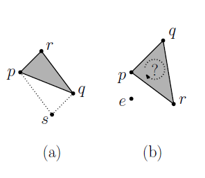

1. Dado um triângulo `△pqr` no plano, explique como determinar um quarto
ponto `s` tal que `{p, s, q, r}` defina um paralelogramo que tem pq como
diagonal (veja Figura a).

    -Podemos, a parir do vértice que possui ângulo de 90° (r), calcular o vetor, no caso da figura, `rp` (p-r), e posteriormente somá-lo ao ponto restante, ou seja, o ponto `q`. Resumindo:`s = q + rp`

    -Outra forma possível, é fazermos ao contrário, calcular o vetor `rq`(q-r) e posteriormente somá-lo com o ponto restante, neste caso, o ponto `p`. Resumindo: `s = q + rp`

1. Um observador está localizado em um ponto `e` no espaço R<sup>3</sup> e
ele enxerga um triângulo definido pelos vértices `p`, `q` e `r`. O lado da
frente desse triângulo é o lado para o qual `p`, `q` e `r` aparecem no
sentido anti-horário e o outro lado é lado de trás. Assumindo que `e` não
é co-planar com o triângulo, **discuta** se o observador vê o lado da
frente do triângulo ou o de trás (veja Figura b).

    - Não podemos afirmar uma resposta única, pois não foi definido um posicionamento fixo para `e`, por isso devemos relacioná-lo com o plano formado por `△pqr`. Uma maneira de fazer isso é através da normal do plano, que pode ser calculada de diversas formas, dadas abaixo: 
    
    a.  `pq x pr`

    b.  `rp x rq`

    c.  `qr x qp`

    Sendo os vetores `ab`, com `a` e `b` podendo ser `p`, `q` ou `r`, calculados através da subtração de `b` por `a`.
    
    - Diante disso, agora iremos calcular um outro vetor, que dependendo da normal escolhida, será o seguinte:
    
    a.  `pe` (e - p)

    b.  `re` (e - r)

    c.  `qe` (e - q)

    - Possuindo agora um vetor normal e um outro vetor relacionando a origem do vetor normal escolhido com o ponto `e`, precisamos calcular o ângulo entre esses dois vetores. Para achar tal angulo basta fazer a seguinte operação: `ângulo = arccos [(u.v)/(|u|.|v|)]`, sendo `u` e `v` os vetores respectivos a normal e ao vetor formado entre a origem do vetor normal e o ponto `e`, e `|u|` e `|v|` seus respectivos módulos.
   
    - Já com o ângulo em mãos, caso seja menor que 90°, o ponto `e` está olhando para a frente do `△pqr`, caso seja maior que 90°, estará olhando para a parte de trás do `△pqr`. Caso seja igual a 90°, o ponto estará coplanar ao `△pqr`, porém tal caso foi retirado pelo enunciado. 

---
### **Questão 3: mudança de sistema de coordenadas** - 1 ponto

Nos itens a seguir - (a) e (b) - você deve efetuar a mudança de sistema de coordenadas.

(a) Considere um cenário em que temos dois sistemas de coordenadas: da janela
(`J`) e do mundo (`M`), definidos em OpenGL da seguinte forma:

```c
void reshape(int w, int h) {
  glViewport(0, 0, 800, 600);     // Define sistema J
  glMatrixMode(GL_PROJECTION);
  glLoadIdentity();
  // left, right, bottom, top, near, far
  glOrtho(0, 800, 0, 600, -1, 1);  // Define sistema M
  glMatrixMode(GL_MODELVIEW);
}
```

![Sistemas de coordenadas da janela e do mundo, com pontos P[J] = (200,100) e Q[J] = (400,300)](images/sistema-coordenadas-1.png)

Dois cliques foram dados nos pontos `P` e `Q`, e suas coordenadas são
capturadas no sistema da janela (`J`). Pede-se:

1. Represente a base e a origem do sistema `J` (_i.e._, `O`<sub>J</sub>,
   `x`<sub>J</sub>, `y`<sub>J</sub> no sistema M.

    - Pensaremos em eixos separadamente, primeiramente em x. Como eles estão alinhados verticalmente, temos que `x`<sub>J</sub> = `x`<sub>M</sub>, com isso podemos concluir que a base `x`<sub>J</sub> em relação ao sistema M é igual a: `x`<sub>JM</sub> = (1,0).
    
    - Iremos levar em consideração, agora, as coordenadas y. Se repararmos atenciosamente, percebemos que se aumentarmos a coordenada de `y`<sub>M</sub> e aumentarmos a coordenada de `y`<sub>J</sub>, ambas cresecem na mesma direção, porém em sentidos opostos. Logo, podemos concluir que `y`<sub>J</sub> = `-1y`<sub>M</sub>, tendo `y`<sub>jM</sub> = (0,-1).

    - Para conseguirmos o relacionamento entre as origens, podemos considerar a origem `O`<sub>J</sub> como se fosse um ponto, e analisar suas coordenadas em relação a origem `O`<sub>M</sub>, obtendo `O`<sub>JM</sub> = (0,600).
  
1. Encontre a matriz de mudança de sistema de coordenadas que leva um ponto
   ou vetor do sistema `J` para o sistema `M`.
    
    - De acordo com as observações retiradas do item anterior, e com ajuda das pesquisas feitas no item um, concluimos que é necessário uma rotação sobre o eixo horizontal e um deslocamento de 600 unidades, obtendo a seguinte matriz de transformação:

    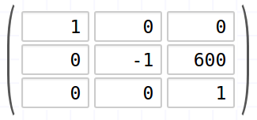
   <!--
     Portanto, a matriz de transformação é:
     |  1   0    0  |
     |  0  -1   600 |
     |  0   0    1  |
   -->
1. Use a matriz para calcular as coordenadas de `P` e `Q` no sistema `M`.
    
    - No item anterior, demonstramos a matriz transformadora de coordenadas. Para saber as coordenados do ponto, basta multiplicar tal matriz com a matriz coluna respectiva as coordenadas do ponto, conforme abaixo:

    - Ponto P

    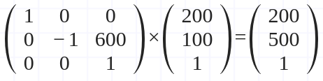

    - Ponto Q

    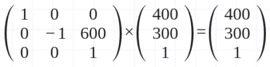


(b) Agora, considere que o sistema da janela é o mesmo, mas o sistema de coordenadas do mundo (`M`) está definido assim:

```c
void reshape(int w, int h) {
 glViewport(0, 0, 800, 600);     // Define sistema J
 glMatrixMode(GL_PROJECTION);
 glLoadIdentity();
 // left, right, bottom, top, near, far
 glOrtho(0, 100, 0, 75, -1, 1);  // Define sistema M
 glMatrixMode(GL_MODELVIEW);
}
```

![Sistemas de coordenadas da janela e do mundo, com pontos P[J] = (200,100) e Q[J] = (400,300)](images/sistema-coordenadas-2.png)

Dois cliques foram dados nos pontos `P` e `Q`, e suas coordenadas são
capturadas no sistema da janela (`J`). Pede-se:

1. Represente a base e a origem do sistema `J` (_i.e._, `O`<sub>J</sub>,
   `x`<sub>J</sub>, `y`<sub>J</sub>) no sistema M.
   <!--
     Pergunta-se: quantos Xm vale 1 Xj?
     Raciocínio: 100Xm equivalem a 800Xj. Logo, Xj = 1/8 Xm. Sendo assim,
                 Xj[M] = (1/8, 0).

                 e quantos Ym vale 1 Yj?
                 75Ym equivalem a 600Yj, mas no sentido contrário. Logo,
                 Yj = -1/8 Ym. Sendo assim, Yj[M] = (0, -1/8)

                 e como chegamos em Oj a partir de Om?
                 Precisamos deslocar no sentido Ym 75 vezes. Logo,
                 Oj[M] = (0, 75)

   -->
1. Encontre a matriz de mudança de sistema de coordenadas que leva um ponto
   ou vetor do sistema `J` para o sistema `M`.
   <!--
     Portanto, a matriz de transformação é:
     | 1/8  0    0  |
     |  0 -1/8  75  |
     |  0   0    1  |
   -->
1. Use a matriz para calcular as coordenadas de `P` e `Q` no sistema `M`.
   <!--
     Basta multiplicar o vetor coluna de cada ponto pela matriz. Para P:
     | 1/8  0    0  |   | 200 |   |   25 |
     |  0 -1/8  75  | x | 100 | = | 62,5 |
     |  0   0    1  |   |   1 |   |    1 |

     Para Q:
     | 1/8  0    0  |   | 400 |   |   50 |
     |  0 -1/8  75  | x | 300 | = | 37,5 |
     |  0   0    1  |   |   1 |   |    1 |

   -->
1. Encontre a matriz inversa daquela encontrada em (1). Se você já aprendeu
   a fazer isso, você pode usar um dos métodos para matrizes 3x3, como
   Gauss-Jordan. Ou, então, use uma calculadora de matrizes inversas online.
   <!--
     A matriz inversa M-¹ é:
     | 8   0     0 |
     | 0  -8   600 |
     | 0   0     1 |
   -->
1. Considerando um ponto `R[M] = (4, 60)`, converta ele para o sistema `J`
   para saber em que pixel ele será desenhado dentro da tela.
   <!--
     Para encontrar R, dado em coordenadas do mundo, no sistema da janela,
     basta multiplicar suas coordenadas pela matriz inversa da encontrada:
     | 8   0     0 |   |  4 |   |         32 |   |  32 |
     | 0  -8   600 | x | 60 | = | -480 + 600 | = | 120 |
     | 0   0     1 |   |  1 |   | 1          |   |   1 |

   -->

---
### **Questão 4** (prática) - 2 pontos:

Crie um <abbr title="Tipo Abstrato de Dados">TAD</abbr> (Tipo Abstrato de Dados) **Coordenadas** que represente um ponto ou um vetor da geometria afim em
3 dimensões + coordenada homogênea. Seu TAD deve representar as coordenadas
usando um tipo de ponto flutuante (_e.g._, **float**, **double**) e deve
implementar as seguintes operações:

- Multiplicação por um escalar
- Soma de dois vetores
- Criação de um vetor por meio de dois pontos (da subtração deles)
- Cálculo da norma de um vetor
- Normalização do vetor
- Produto vetorial
- Produto escalar (_dot product_)
- Menor ângulo entre dois vetores
- Combinação afim de dois pontos

Você deve fazer seu TAD em um módulo `coordenadas.c` e `coordenadas.h` usando
a linguagem C. Você deve pegar [o código fonte seminal][codigo-seminal], já
contendo uma estrutura de dados `struct coordenada` e dois tipos `vetor` e
`ponto` e implementar o corpo das funções.

#### Notas sobre o **código seminal**

Repare que o código é composto por 3 arquivos:

- `coordenadas.h` e `coordenadas.c` (módulo `coordenadas`)
- `teste-coordenadas.c`, que contém um `int main(...)` e verifica se as
  operações que você implementou estão corretas
  - O código usa uma biblioteca padrão do C chamada `assert.h`, que vai
    verificar se as operações foram devidamente implementadas e, em caso
    negativo, mostra uma mensagem de erro e encerra o programa.

Devido ao uso do `assert.h`, até que todas as funções estejam devidamente
implementadas, o programa será encerrado com erro. Portanto, sugiro
implementar o corpo das funções (`coordenadas.c`) de cima pra baixo. Se o
seu programa imprimir uma mensagem de sucesso para todos os testes, ele
estará pronto e funcionando perfeitamente.

Para desenvolver e executar o código, você pode usar uma das duas alternativas:

- O Makefile, com os comandos:
  - Para compilar:
    ```
    $ make
    ```
  - Para executar os testes (arquivo `teste-coordenadas.c`):
    ```
    $ make run
    ```
  - Para apagar os arquivos temporários e binário:
    ```
    $ make clean
    ```
- O projeto do CodeBlocks

[codigo-seminal]: https://github.com/fegemo/tad-coordenadas/archive/master.zip# CG---Lista-de-exerc-cios---Geometria-Afim-e-Euclidiana
Lista de Exercícios Geometria Afim e Euclidiana - Disciplina de Computação Gráfica
